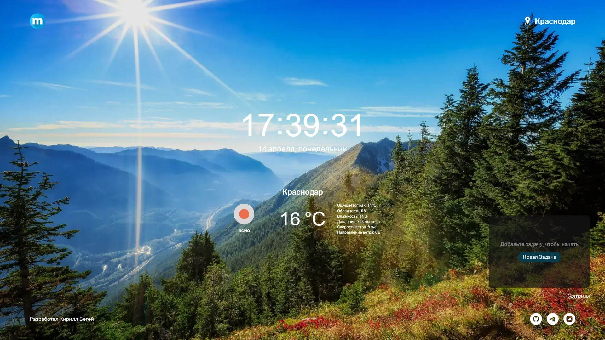

# Проект "Momentum" — Персональный виджет-органайзер

## О проекте

Momentum — это веб-приложение, вдохновлённое одноимённым расширением для браузера. Оно отображает текущее время, дату, погоду в вашем регионе, а также предоставляет функциональность списка задач. Приложение визуально адаптируется под время суток, подгружая соответствующее фоновое изображение. Задачи можно добавлять, удалять, отмечать выполненными и очищать выполненные одним кликом.

Проект выполнен в рамках практики по созданию интерактивных клиентских приложений.

## Превью проекта



## Ссылка на демо

- [Открыть приложение](https://momentum-peach.vercel.app/)

## Статус проекта

✅ Завершён и задеплоен.

## Функциональность

- **Виджет часов и даты**: Показывает текущее время в формате `ЧЧ:ММ:СС`, а также полную дату.
- **Геолокация и погода**: Определение города пользователя и отображение актуальных погодных данных.
- **Фоновое изображение**: Меняется в зависимости от времени суток.
- **Список задач**:
  - Добавление, удаление, выполнение задач.
  - Кнопка для удаления всех завершённых задач.
  - Подсказки и валидация при пустом вводе.
- **Адаптивный дизайн**: Приложение корректно отображается на различных устройствах.
- **Семантическая разметка и БЭМ-структура**.

## Технологии и инструменты

- **HTML5** — Семантическая вёрстка.
- **CSS3** — Flexbox, адаптивность, кастомные стили.
- **JavaScript** — Взаимодействие с API, динамическое обновление данных, логика задач.
- **Методология БЭМ** — Читаемая и масштабируемая структура классов.
- **Webpack** — Сборка проекта и оптимизация ассетов.

## Используемые API

- [Яндекс Геокодер](https://yandex.ru/maps-api/products/geocoder-api) — Определение названия города по координатам.
- [OpenWeather](https://openweathermap.org/) — Получение погодной информации по координатам пользователя.

## Как запустить проект локально

1. Клонируйте репозиторий:

```bash
git clone https://github.com/kirill-io/momentum-project.git
```

2. Перейдите в папку проекта:

```bash
cd momentum-project
```

3. Установите зависимости:

```bash
npm install
```

4. Создайте .env файл в корне проекта и добавьте туда ключи API (пример в .env.example).

5. Запустите проект в режиме разработки:

```bash
npm run start
```

6. Для сборки проекта используйте:

```bash
npm run build:prod
```

## Проверка кода

- ESLint — Проверка JavaScript:

  ```bash
  npm run lint:js
  npm run lint:js:fix
  ```

- Stylelint — Проверка стилей:

  ```bash
  npm run lint:css
  npm run lint:css:fix
  ```
